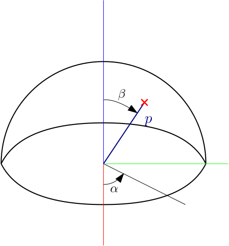

# Camera Calibration Package

## General
This package provides camera calibration and eye-in-hand routine using Aruco calibration chessboard.
During the routine your robot is moved to positions specified in file and captures images from specified ROS topic.
Images are saved with corresponding `yaml` file of the same name as the image.
This `yaml` file contains information about the image and pose of robot in which the image was captured.
Calibration it self is ran separately from ROS as requires Python3 modules.

Calibration returns camera matrix, distortion coefficients, transform matrix from end-effector to camera optical frame and transform matrix from robot base frame to frame of calibration pattern. It also creates directory named by date and time of the calibration with calibration results and re-projections.

## Function and results
### Image capturing
Package provides image-capturing node `camera_calibration.py`. Node is configured via file `/config/image_capture_config.yaml`, see [configuration](#image-capture-configuration). Node uses moveIt commander to move robot. Robot is moved to position defined in `txt` file, one line represents one pose (position and roation in quaternion). In each pose one image is taken and stored with `yaml` file containig information about the image. First pose is represented as a starting pose and no image is taken. After all images are taken robot returns to the starting pose.
### Pose file generation
Poses can be generated using script `compute points.py`. In the beginng of the `main()` function is list of dictionaries named `points`. Each item of `points` contain definition of point in space. These points are stored in file in the same order as are in list. Script requires definition of `base_xyz` list containing RPY of the base orientation of manipulator. For example the orientation to point end effector to the XY plain.
Points can be of two types, point on the shpere or the plain.
``` py
{'type':'plain', 'center':[0,0,0], 'offset': [0.3, 0, 0.6], 'orientation': 0},
```
Center defines 'center' of the plain (plain mathematically has no center, but in this case it is handy to pretend it has). Offset defines position in relation to center. End effector of robot points in direction of `base_xyz`, but the end effector can be rotated arround normal of the plain end effector points to by setting orientation parameter.
``` py
{'type':'sphere','center':[0.4, 0, 0] , 'radius': 0.5, 'alpha': 3*pi/4, 'beta': pi/12, 'orientation':0},
```


End effector points to the center of the center of the sphere. Orientation parameter rotates end effector around axis p.

### Camera calibration
Script `camera_calibration.py` contains routine to calibrate eye-in-hand and camera calibration. The script is configured via `yaml` file, see [configuration](#image-capture-configuration). Calibration is divided into two parts, camera calibration and eye-in-hand calibration. During calibration are stored results like images with detected markers, re-projection errors and images with drawn re-projected points and error vectors. Results of each part are stored separately.

Durring eye-in-hand calibration is usend numerical method to estimate this transform. To estimate the transform from base of your robot to checker board frame we compute this transform for each image separately. As the eye-in-hand calibration is impossible to compute analytically, the transform from base to checker board is slightly different for each image. Each transform from base to checker board is stored into a `yaml` file. To get the final transform from base to checker board we take mean translation and rotation vectors and compose matrix. Function also stores two graphs showing deviation in position and rotation for each image from average vector.

Finally the function stores the calibration result into a `yaml` file. Name of this file is defined in configuration file. Data are stored in camera_calibration format compatible with ROS. This file is also compatible with [Eyeinhand Calibration Publisher](https://gitlab.ciirc.cvut.cz/chaloto3/eyeinhand_calibration_publisher).

### Testing
Script `test.py` allows to compute re-projection error on testing images. Script is configured in `yaml` file, see [configuration](#testing-configuration). Script stores results such as images with drawn reprojected points and error vectors.

## Configuration
### Image capture configuration
In file `/config/image_capture_config.yaml` is configured image capturing routine. It provides following parameters in namespace `camera_calibration`.

__directory__: Path (string) where captured images and `yaml` files are to be stored. The date and time will be appended to the directory in format dd-mm-yy-hh:mm.

__group__: Name of the planning group defined in SRDF of your robot.

__image_names__: Part of image name all images share. The rest of image name is specified by parameter __use_time_in_image_names__.

__use_time_in_image_names__: Boolean, it True date and time will be added to the image names in format dd-mm-yy-hh:mm:ss, else are images enumerate.

__positions_file__: File in `txt` containing poses to capture images in. Each line of the file represents one pose. The first line represents the starting pose where no image is captured. After capturing is done, robot returns to the starting position. If name contains 'joint', poses are interpreted as joint coordinates.

__max_speed__: Maximal speed of robot scaling factor. Set accordingly to your needs to prevent shaking and collisions.

__image_topic__: Name of ROS topic from which images are read. **_The topic type must be `sensor_msgs.msg.Image`!_**


### Calibration configuration
In file `/config/calibration_config.yaml` is configured image capturing routine. It provides following parameters.

__directory__: Path (string) where images and yaml files which are to be used in calibration are stored.

__aruco_dictionary__: aruco dictionary key, refer to [aruco enumerate](https://docs.opencv.org/4.5.2/d9/d6a/group__aruco.html#gac84398a9ed9dd01306592dd616c2c975).

__board_squaresX__: Number of squares in X direction of the calibration pattern

__board_squaresY__: Number of squares in Y direction of the calibration pattern

__board_square_size__: Length of one side of the square. (In meters).

__board_marker_size__: Length of one side of the marker. (In meters).

__board_scaling__: List of scaling coefficients when squares are not symmetrical.

__calibration_method__: Method which is to be used in calibration. Refer to [OpenCV2 documentation](https://docs.opencv.org/4.5.2/d9/d0c/group__calib3d.html#gad10a5ef12ee3499a0774c7904a801b99)

__animate__: Boolean, if True, calibration will show you images with detected markers and points re-projected into the image with vector showing the direction of correct projection.

__result_directory__: Directory where result files are to be stored. In this directory new directory is created named by time and date od the calibration.

__result_name__: `yaml` file in which final results are stored. The data are stored in camera_calibration format compatible with ROS. This file is also compatible with [Eyeinhand Calibration Publisher](https://gitlab.ciirc.cvut.cz/chaloto3/eyeinhand_calibration_publisher).

__error_scaling_factor__: Factor scaling error vector in re-projection error image.

### Testing configuration
In file `/config/test_config.yaml` is configured image capturing routine. It provides following parameters.

__directory__: Path (string) where images and `yaml` files, which are to be used as testing data, are stored.

__aruco_dictionary__: aruco dictionary key, refer to [aruco enumerate](https://docs.opencv.org/4.5.2/d9/d6a/group__aruco.html#gac84398a9ed9dd01306592dd616c2c975).

__board_squaresX__: Number of squares in X direction of the calibration pattern

__board_squaresY__: Number of squares in Y direction of the calibration pattern

__board_square_size__: Length of one side of the square. (In meters).

__board_marker_size__: Length of one side of the marker. (In meters).

__board_scaling__: List of scaling coefficients when squares are not symmetrical.

__animate__: Boolean, if True, calibration will show you images with detected markers and points re-projected into the image with vector showing the direction of correct projection.

__calibration_data_directory__: Path to the directory where the calibration result is stored.

__calibration_name__: Name of the file with the final calibration result.

__test_directory__: Path to the directory where test results are to be stored.

__error_scaling_factor__: Factor scaling error vector in re-projection error image.

## Usage
Configure package using configuration `yaml` files. To start the calibration routine simply open new terminal and run
```
roslaunch camera_calibration_pkg calibration.launch
```
When the capturing is complete run
```
roscd camera_calibration_pkg/scripts
python3 ./scripts/camera_calibration.py
```
Function prints the result stores it if is configured so.

# Functions
* __cam_mtx, dist_coef, rvecs, tvecs, unused_images = calibrate_camera(images, img_path, board, aruco_dict, squares_scale=(1,1), animate=False)__:
  * images - list of image names to use in calibration
  * img_path - path to directory with calibration images
  * board - aruco board object
  * aruco_dict - aruco dictionary object
  * squares_scale - list of scaling coefficients when squares are not symmetrical.
  * animate - boolean, if True, calibration will show you images with detected markers and points re-projected into the image using camera_matrix
  * cam_mtx - homogeneous camera projection matrix
  * dist_coef - list of distortion coefficients
  * rvecs - list of rotation vectors from the object coordinate space (in which object points are specified) to the camera coordinate space. The i-th vector corresponds to the i-th image.
  * tvecs - list of translation vectors from the object coordinate space (in which object points are specified) to the camera coordinate space. The i-th vector corresponds to the i-th image.
  * unused_images - images which were refused for calibration.
* __Tcamera_gripper, Tbase_target = calibrate_eye_in_hand(calibration_data, method)__:
  * calibration_data - dictionary, where every entry is another dictionary. Each entry corresponds to one pose and must contain keys 'r_mtx' (rotation matrix from base_link of the robot to end-effector), pose of end-effector, 'rvec' (rotation vector from the object coordinate space (in which object points are specified) to the camera coordinate space) and 'tvec' (translation vector from the object coordinate space (in which object points are specified) to the camera coordinate space).
  * method - calibration method. Refer to [OpenCV2 documentation](https://docs.opencv.org/4.5.2/d9/d0c/group__calib3d.html#gad10a5ef12ee3499a0774c7904a801b99)
  * Tcamera_gripper - homogeneous matrix transforming coordinates from camera frame to end-effector frame
  * Tbase_target - homogeneous matrix transforming coordinates from base frame of the robot to frame of the calibration pattern.

* __reprojection_error(image, board, aruco_dict, squares_scale, T, camera_matrix, dist_coef, error_scaling_factor=50, animate=False)__

 Prints re-projection error of points detected in image (absolute path + image name).
  * board - aruco board object
  * aruco_dict - aruco dictionary object
  * Transform matrix T is a homogeneous matrix from frame of the checker board to camera frame.
  * camera_matrix - homogeneous camera projection matrix
  * dist_coef - list of distortion coefficients
  * If boolean animate is True, function shows testing image. Red crosses are re-projected points and yellow lines represent error vector pointing in direction to correct position. The error vector is scaled by float error_scaling_factor.

* __T = get_Ttarget2camera(Tbase2target, Tgripper2base, Tcamera2gripper)__
  * T is homogeneous matrix from frame of the checker board to camera frame.
  * Input arguments are homogeneous transforms

## Calibration Suggestions
These suggestions will help to increase the calibration accuracy.
* Use calibration pattern as large as is your robots workspace.
* The calibration pattern should cover the whole image or it's major part
* The more squares covers the image, the better
* Capture images on half-spheres with origins in approximate centre of the calibration pattern. The optical axis of the camera should cross the origin of the half-sphere always. We suggest capture on at least three half-spheres with different radius.
* In some poses rotate camera around optical frame with 45 degrees.
* Capture around 20-30 images.

## Requirements
For correct work you need following python and ROS packages.

Python:
* Numpy
* OpenCV2 in complete version (containing modules of 3-th party)
* Pyyaml

ROS:
* MoveIt
* TF
* CvBridge
